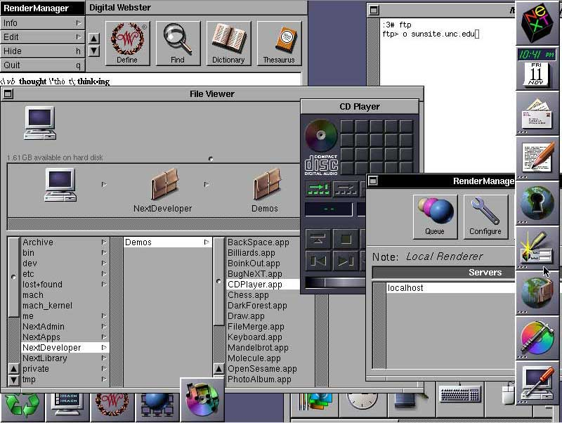

## Learn Objective-C: A Brief History

The Objective-C programming language has had a humble history. Created by Brad Cox in the early 1980s as an extension of the venerated C, pioneered a decade earlier by Dennis Ritchie, the language was based on another called SmallTalk-80.

NeXT Software licensed the language in the 1988, and developed a code library called NeXTSTEP.

When Apple Computer acquired NeXT in 1996, the NeXTSTEP code library was built into the core of Apple’s operating system, Mac OS X. NeXTSTEP provided Apple with a modern OS foundation, which Apple could not produce on its own.

The iPhone’s operating system, currently dubbed iOS, is based off of a reduced version of OS X. Therefore, iOS inherits most of the NeXTSTEP code library, along with extensive modernization and optimizations. Because NeXTSTEP was built from Objective-C, iOS mirrors the language choice. This made it easy for OS X developers to begin creating apps for the iPhone and iPod Touch.

Apple added a number of features to the Objective-C language, extending its functionality to parallel that of other languages that were beginning to arise. This major update was labeled Objective-C 2.0, and remains the language of choice for both OS X and iOS. This iteration will be covered in this tutorial.

*This post is part of the [Learn Objective-C in 24 Days](38.md) course.*

---

[Previous Lesson](38.md) | [Next Lesson](39.md)
