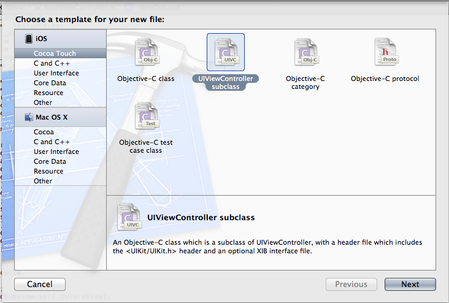
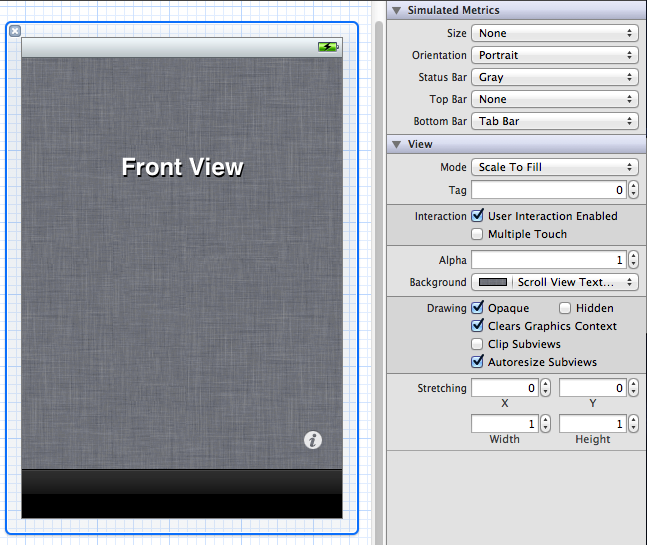

## Learn Objective-C, Building an App (Part 3): Flipping and Tab Bars 

In previous tutorials we've been using some basic UIKit elements on standard views. Today, we're going to add a tab bar to our application and wire it up; it'll pave the way for some more compelling future expansions. Tab bars are more involved than the regular views we've been using; in additional to simply setting and accessing properties, we also have to contend with a specific controller and design pattern, as well as delegates. Let's get started. 

### Tab Bar Controllers 

In most cases, tab bars are used with UITabBarController. You may use an independent tab bar if you're using it to display the same information in the same view, just sorted differently, for example. However, if you plan on swapping views around, you should use the controller because it manages the swapping mechanism and paradigms for you. 

According to Apple's documentation, "The UITabBarController class implements a specialized view controller that manages a radio-style selection interface.…[Y]ou use instances of it as-is to present an interface that allows the user to choose between different modes of operation. This tab bar interface displays tabs at the bottom of the window for selecting between the different modes and for displaying the views for that mode." Tab bars are prevalent in many of the standard iOS apps, including Clock and Music. 

Rather than accessing the tab bar itself (Apple claims that "You should never access the tab bar view of a tab bar controller directly"), you should pass the tab bar controller an array of UIViewControllers (or subclasses of it) to a property called viewControllers. The ordering in the array determines the order of the tabs. Alternatively, you can configure the tabs' order, title and icon in Interface Builder. When a tab is selected, the controller will load the root view controller for the corresponding tab in the main content view. This means that if you've drilled into a navigation stack (which we will be covering in a future post), you will be returned back to the top of the stack, even if you tap the tab you're currently on. By default the state of the view is not saved; however, you can do initial configuration in your own controllers to do so. Any class can become the [delegate](74.md) of the tab bar and receive notifications about changes. As per the nature of delegation, this is completely optional; proper configuration in Interface Builder means that the view swapping will work fine without having to create a delegate. 

### Getting Started 

Today we'll be creating a second view controller to have something to switch to, and then we'll create a tab bar controller and implement the switching. The process is really intuitive once you know where to begin—so let's begin! 

Begin by creating a New File in Xcode. Make sure UIViewController subclass is selected in the Template pane and click Next. 



*New UIViewController Subclass File*

The Class name should be FlipViewController. It should be a Subclass of `UIViewController`, not be targeted for iPad, and have a XIB for the user interface. Click Next, and then Create (unless you want to change the file save location or the group the new files get placed under—go ahead). You'll get three new files—FlipViewController.h, FlipViewController.m, and FlipViewController.xib. Here, we'll create a very simple view that implements a flip-over view like you might see in the Weather or Stocks app. Start by creating two `UIView`s in the header, making sure to declare them as IBOutlets and calling them frontView and backView. In the XIB, drag out two `UIView`s from the Library. Connect the views—Control drag from the File's Owner (the first icon on the strip to the left) down to the views and make the connections as you're used to. In the view you've designated to be the front, choose a dark color for the Background and then drag out a UIButton. In the Attributes Inspector, next to Type, select Info Light to get you the little "i" button that you've seen around iOS. Align that with the bottom right corner of the view. Also in each view, add a label with "Front view" and "Back view", just for reference. In your back view, add a regular `UIButton` in the upper left corner with the text "Done". This follows the standard UI design pattern—if you're using an info button to go to another view, the info button should be in the lower-right corner; a Done button to return sometimes may be in a nav bar (which we'll cover in a later post), but is usually in the upper-left corner. 

Now connect the actions. The method to go to the back view should be called `flipToBack:` and take a sender. The method to go back should be called `flipToFront:` and also take a sender. Of course, make sure the methods are defined in the header, save both the header and the XIB, and go to the .m file. Synthesize the `frontView` and `backView`. Add the following line to viewDidLoad after the existing code: 
    
```objc
[self.view addSubview:self.frontView];
```

This will make the `frontView` visible. Next we'll implement the flipping methods: 
    
```objc
- (IBAction)flipToBack:(id)sender {
    [UIView transitionFromView:self.frontView toView:self.backView
                duration:1.0 
                options:(UIViewAnimationOptionCurveEaseInOut | UIViewAnimationOptionTransitionFlipFromRight)
                completion:NULL];
}

- (IBAction)flipToFront:(id)sender {
    [UIView transitionFromView:self.backView toView:self.frontView
                duration:1.0 
                options:(UIViewAnimationOptionCurveEaseInOut | UIViewAnimationOptionTransitionFlipFromLeft)
            completion:NULL];
}
```

These methods are rather similar. We're calling new UIView animation methods introduced with iOS 4 that replaced a more verbose and complicated system from before; these methods also take advantage of blocks which were also new with iOS 4 and, again, will be covered in the future. Here, we're asking it to transition from one view to another. It'll draw one view, and then animate in the other based on the options you pass in. The duration is the length of the time you want the animation to take. The `options` are a list of [options](https://developer.apple.com/documentation/uikit/uiviewanimationoptions?language=objc) you can pass in; you can combine them any way you want (barring conflicting options) using the bitwise OR operator (`|`) and enclosing the group in parentheses. Here, we're telling the animation to use a smooth, natural ease-in and then ease-out at the end. Other options include a linear path, or just ease-in or just ease-out. Finally, you can pass a block in when the animation completes; we're not going to do anything here for the moment. Our view controller is done—so let's build our tab bar controller. 

### Creating the Tab Bar Controller 

Open AppDelegate.h and add a tab bar controller property: 
    
```objc
@property (nonatomic, retain) UITabBarController *tabBarController;
```

Synthesize the property. In the implementation, import FlipViewController.h and then release tabBarController in the dealloc method. Then create the tab bar controller: 
    
```objc
RootViewController *rootViewController = [[RootViewController alloc] initWithNibName:@"RootViewController" bundle:nil];
rootViewController.title = @"Root View Controller";
FlipViewController *flipViewController = [[FlipViewController alloc] initWithNibName:@"FlipViewController" bundle:nil];
flipViewController.title = @"Flip View Controller";
self.tabBarController = [[UITabBarController alloc] init];
self.tabBarController.viewControllers = [NSArray arrayWithObjects:rootViewController, flipViewController, nil];
self.window.rootViewController = self.tabBarController;
```

First we create the view controllers and set their title. The title of the view controllers is the title that the tab bar displays. We then create a tab bar controller and set the view controllers as an array. You then set the root view controller as before. 

If you run the program now, you'll get a working app with a tab bar at the bottom. Switch between the tabs and go to the Flip View Controller-and you'll realize the issue we have. The tab bar is in fact obscuring the flip button. The solution is rather simple—go to FlipViewController.xib. 



*Simulated Tab Bar & Moved Button*

Select the front view and move up the Info button. Select the front view itself and go to the Attributes Inspector. Under Simulated Metrics, select Tab Bar from the list next to Bottom Bar. Using that as a guide, position the info button. Build and run again. The flip view will work as you've seen in other Apple apps. 

### Apple's Progression 

In iOS 5, Apple's recommended way to create controllers is through code in the App Delegate. In previous versions you'd have started with a MainWindow.xib which you can configure in Interface Builder. I feel that because from now on all project templates will feature this new code, it is important to get to know it. 

You can download the current iteration of the file [here](../code_resources/Building%20an%20App%20Part%203%20-%20Flipping%20and%20Tab%20Bars).

*This post is part of the [Learn Objective-C in 24 Days](38.md) course.*

---

[Previous Lesson](91.md) | [Next Lesson](93.md)
